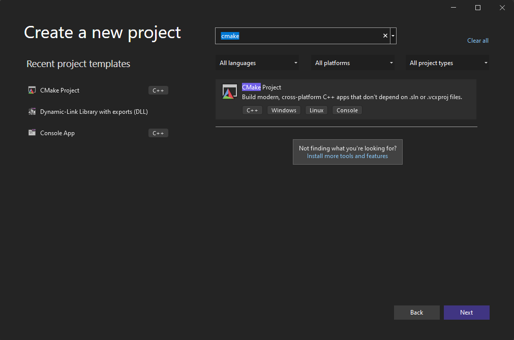

# Visual Studio CMake builder
Visual Studio CMake builder is a script to build a CMake project created by Visual Studio.

## Accidentally delete a x86|x64-release|debug directory and Visual Studio does not fix it?
This script can help you :D

## How works?
The script search the VS installations saving them in a file in the root project directory called vs_paths.txt and asks to you which use, if you delete it the script will search again the VS installations. Furthermore, asks to you if you want to build x86 or x64 or both in 'Release' mode.

For clang.exe support purpose, is necessary delete all out\build\. files recursively and/or directories and the script does it, so is important that you know it.

You can modify the compiler such as `cl.exe` or `clang.exe` in code:

```
set _CC=cl.exe
set _CXX=cl.exe
```

This script is easily modifiable and you can avoid some question by script to adapt it to your need, ex  

## How execute it?
Only is necesary copy the build.cmd to project root directory and execute it.

- First, create a CMake project
\
\


- Copy the build.cmd script file

```
D:\test>dir
 Volume in drive D is pwning
 Volume Serial Number is 7A56-3F84

 Directory of D:\test

03/21/2022  06:40 PM    <DIR>          .
03/21/2022  06:39 PM    <DIR>          .vs
03/21/2022  06:27 PM             3,466 build.cmd
03/21/2022  06:39 PM               225 CMakeLists.txt
03/21/2022  06:39 PM             1,795 CMakePresets.json
03/21/2022  06:39 PM    <DIR>          out
03/21/2022  06:39 PM    <DIR>          test
               3 File(s)          5,486 bytes
               4 Dir(s)  1,125,976,887,296 bytes free
```

- Execute the script

```
D:\test>dir out\build
 Volume in drive D is pwning
 Volume Serial Number is 7A56-3F84

 Directory of D:\test\out\build

03/21/2022  06:39 PM    <DIR>          .
03/21/2022  06:39 PM    <DIR>          ..
03/21/2022  06:39 PM    <DIR>          x64-debug
               0 File(s)              0 bytes
               3 Dir(s)  1,125,976,891,392 bytes free
               
D:\test>build.cmd
Choose options to build
[1] x86
[2] x64
[3] x86 and x64
Enter a ID: 3
**********************************************************************
** Visual Studio 2022 Developer Command Prompt v17.1.1
** Copyright (c) 2021 Microsoft Corporation
**********************************************************************
[vcvarsall.bat] Environment initialized for: 'x86'
-- The C compiler identification is MSVC 19.31.31104.0
-- The CXX compiler identification is MSVC 19.31.31104.0
-- Detecting C compiler ABI info
-- Detecting C compiler ABI info - done
-- Check for working C compiler: C:/Program Files/Microsoft Visual Studio/2022/Professional/VC/Tools/MSVC/14.31.31103/bin/Hostx86/x86/cl.exe - skipped
-- Detecting C compile features
-- Detecting C compile features - done
-- Detecting CXX compiler ABI info
-- Detecting CXX compiler ABI info - done
-- Check for working CXX compiler: C:/Program Files/Microsoft Visual Studio/2022/Professional/VC/Tools/MSVC/14.31.31103/bin/Hostx86/x86/cl.exe - skipped
-- Detecting CXX compile features
-- Detecting CXX compile features - done
-- Configuring done
-- Generating done
-- Build files have been written to: D:/test/out/build/x86-release
[1/1] Cleaning all built files...
Cleaning... 0 files.
[2/2] Linking CXX executable test\test.exe
**********************************************************************
** Visual Studio 2022 Developer Command Prompt v17.1.1
** Copyright (c) 2021 Microsoft Corporation
**********************************************************************
[vcvarsall.bat] Environment initialized for: 'x64'
-- The C compiler identification is MSVC 19.31.31104.0
-- The CXX compiler identification is MSVC 19.31.31104.0
-- Detecting C compiler ABI info
-- Detecting C compiler ABI info - done
-- Check for working C compiler: C:/Program Files/Microsoft Visual Studio/2022/Professional/VC/Tools/MSVC/14.31.31103/bin/Hostx64/x64/cl.exe - skipped
-- Detecting C compile features
-- Detecting C compile features - done
-- Detecting CXX compiler ABI info
-- Detecting CXX compiler ABI info - done
-- Check for working CXX compiler: C:/Program Files/Microsoft Visual Studio/2022/Professional/VC/Tools/MSVC/14.31.31103/bin/Hostx64/x64/cl.exe - skipped
-- Detecting CXX compile features
-- Detecting CXX compile features - done
-- Configuring done
-- Generating done
-- Build files have been written to: D:/test/out/build/x64-release
[1/1] Cleaning all built files...
Cleaning... 0 files.
[2/2] Linking CXX executable test\test.exe

D:\test>dir out\build
 Volume in drive D is pwning
 Volume Serial Number is 7A56-3F84

 Directory of D:\test\out\build

03/21/2022  06:40 PM    <DIR>          .
03/21/2022  06:39 PM    <DIR>          ..
03/21/2022  06:39 PM    <DIR>          x64-debug
03/21/2022  06:40 PM    <DIR>          x64-release
03/21/2022  06:40 PM    <DIR>          x86-release
               0 File(s)              0 bytes
               5 Dir(s)  1,125,975,904,256 bytes free

D:\test>out\build\x64-release\test\test.exe
Hello CMake.
```

## TODO
- Make debug builds
